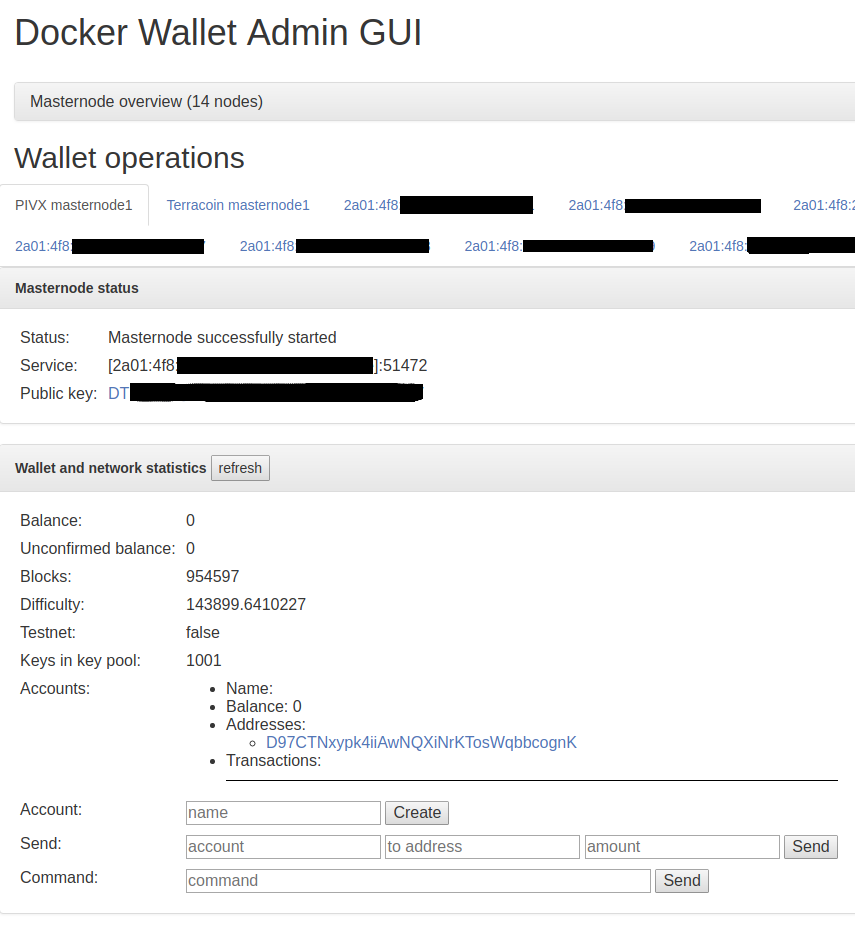
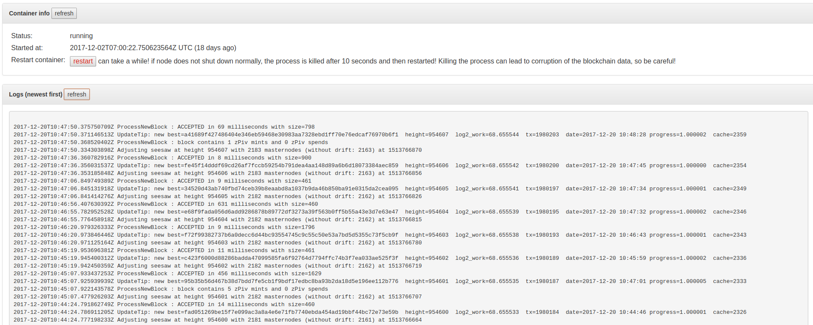
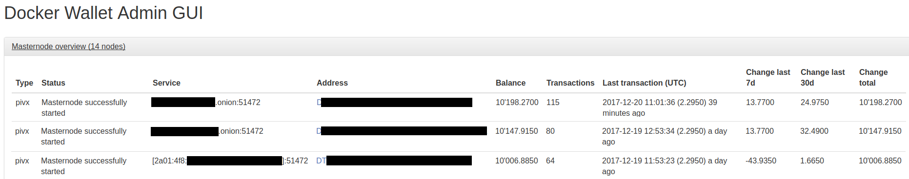

# docker-wallet-control

[](https://travis-ci.org/guggero/docker-wallet-control)
[](https://github.com/guggero/docker-wallet-control/blob/master/LICENSE)

Wallet Control admin layer for Crypto Wallets/Masternodes running in a docker environment.

**This is highly experimental and should only be used by people who know what they do!**

Running this app requires to open the RPC ports of Crypto Wallets.
This can be very dangerous if done incorrectly and you could get all your coins stolen!

**You have been warned!**

## Features

This tool has been developed with the following features in mind (most of them are already working):
* Administer multiple Crypto Currency Wallets that run on the same docker machine
* Wallet account and address management, including sending coins
* Wallet RPC command invocation
* Docker container status
* Docker container restart
* Docker container logs
* Masternode status (tested with PIVX and TRC)
* Masternode earnings overview (currently PIVX only)

## Setup your network

I recommend to create an internal network in docker where all your wallets are connected to.
That way, the RPC port does not need to be exposed to the internet but the Wallet Control can still connect to it.

```bash
docker network create --driver bridge internal
```

### Start a wallet/masternode on the internal network

Here we start an example PIVX wallet in masternode mode that will get the hostname `pivx` assigned on the internal network.

```bash
docker run \
  -d \
  -v /some/data/dir:/pivx \
  --restart always \
  --network internal \
  --name pivx \
  guggero/pivx
```

Notice, that there is no `-p` parameter, so the RPC port is not exposed to the internet/external network, it is only reachable
through the network `internal`. You should still be careful and set a strong password!

[See here for more information about the PIVX masternode docker container.](https://github.com/guggero/docker-pivx-masternode) 

## Add configuration file

You should create a file called `config.json` that you can then mount into the container as seen above.

> Example of a config.json:
```json
{
  "rpcUser": "jsonrpcuser",
  "rpcPassword": "some_safe_password_be_careful_or_your_money_will_get_stolen_you_have_been_warned!",
  "wallets": [
    {
      "label": "PIVX masternode1",
      "containerName": "pivx",
      "type": "pivx",
      "rpcPort": 51473,
      "allowedUsers": ["test"]
    }
  ],
  "useClientCertAuth": false,
  "serveTLS": true,
  "serverAddress": "",
  "serverPort": 8443,
  "users": [
    {
      "username": "test",
      "password": "37268335dd6931045bdcdf92623ff819a64244b53d0e746d438797349d4da578",
      "salt": "test"
    }
  ],
  "uiData": {
    "apis": {
      "link": "https://chainz.cryptoid.info/%s/address.dws?%s.htm",
      "address": "https://chainz.cryptoid.info/%s/api.dws?q=multiaddr&active=%s&key=22ea057c8f38&n=9999999"
    }
  }
}
```

The password is the SHA256 sum of salt+password.

Example for salt `foo` and password `bar`:

```bash
$ echo -n "foobar" | sha256sum
c3ab8ff13720e8ad9047dd39466b3c8974e592c2fa383d4a3960714caef0c4f2  -
``` 


## SSL/TLS configuration

To configure TLS (if either `useClientCertAuth` or `serveTLS` in the configuration file is set to `true`),
you need to mount a directory containing the certs to /go/tls:

```bash
docker run \
  -d \
  ...
  -v /some/dir/tls:/tls \
  ...
  guggero/docker-wallet-control
```

This directory should contain the following files:

* **server.key:** The RSA private key for the certificate without a password set
* **server.pem:** The server certificate
* **cacert.pem:** Optional, the CA used if client certificate authentication is enabled

## Start the Wallet Control container

For this next step, we assume that you have saved the configuration file created in the previous step under
the path `/some/dir/config/config.json`.

Start the Wallet Control container with the following command:

```bash
docker run \
  -d \
  -p 8443:8443 \
  -v /var/run/docker.sock:/var/run/docker.sock:ro \
  -v /some/dir/config/config.json:/config.json \
  -v /some/dir/tls:/tls \
  --restart always \
  --network internal \
  --name wallet-control \
  guggero/docker-wallet-control
```

You should now be able to connect to your docker host on the port `8443` with `https://`.

## Setup without TLS

If you want to set up the Wallet Control without SSL/TLS encryption (*not* recommended), you can change the following values:

> config.json
```json
  "useClientCertAuth": false,
  "serveTLS": false,
  "serverAddress": "",
  "serverPort": 80,
```
Run container with:
```bash
docker run \
  -d \
  -p 80:80 \
  -v /var/run/docker.sock:/var/run/docker.sock:ro \
  -v /some/dir/config/config.json:/config.json \
  --restart always \
  --network internal \
  --name wallet-control \
  guggero/docker-wallet-control
```

You should now be able to connect to your docker host on the port `80` with `http://`.
Be aware that your passwords are now transmitted unencrypted!

## Screenshots

### Collapsed masternode overview, tabs with all wallets, masternode status and wallet information for selected wallet:



### Docker container info and logs:



### RPC command output:


### Expanded Masternode overview:

